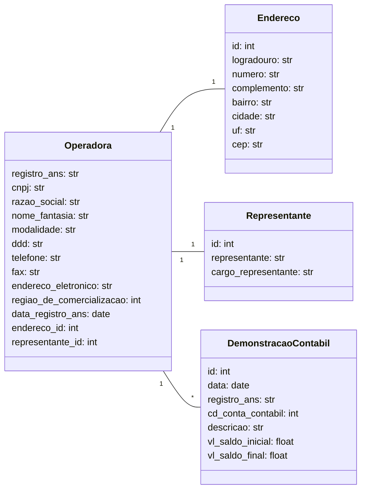

```mermaid
classDiagram
  direction LR
  class Operadora {
    registro_ans: str
    cnpj: str
    razao_social: str
    nome_fantasia: str
    modalidade: str
    ddd: str
    telefone: str
    fax: str
    endereco_eletronico: str
    regiao_de_comercializacao: int
    data_registro_ans: date
    endereco_id: int
    representante_id: int
  }

  class Endereco {
    id: int
    logradouro: str
    numero: str
    complemento: str
    bairro: str
    cidade: str
    uf: str
    cep: str
  }

  class Representante {
    id: int
    representante: str
    cargo_representante: str
  }

  class DemonstracaoContabil {
    id: int
    data: date
    registro_ans: str
    cd_conta_contabil: int
    descricao: str
    vl_saldo_inicial: float
    vl_saldo_final: float
  }

  Operadora "1" -- "1" Endereco
  Operadora "1" -- "1" Representante
  Operadora "1" -- "*" DemonstracaoContabil
```