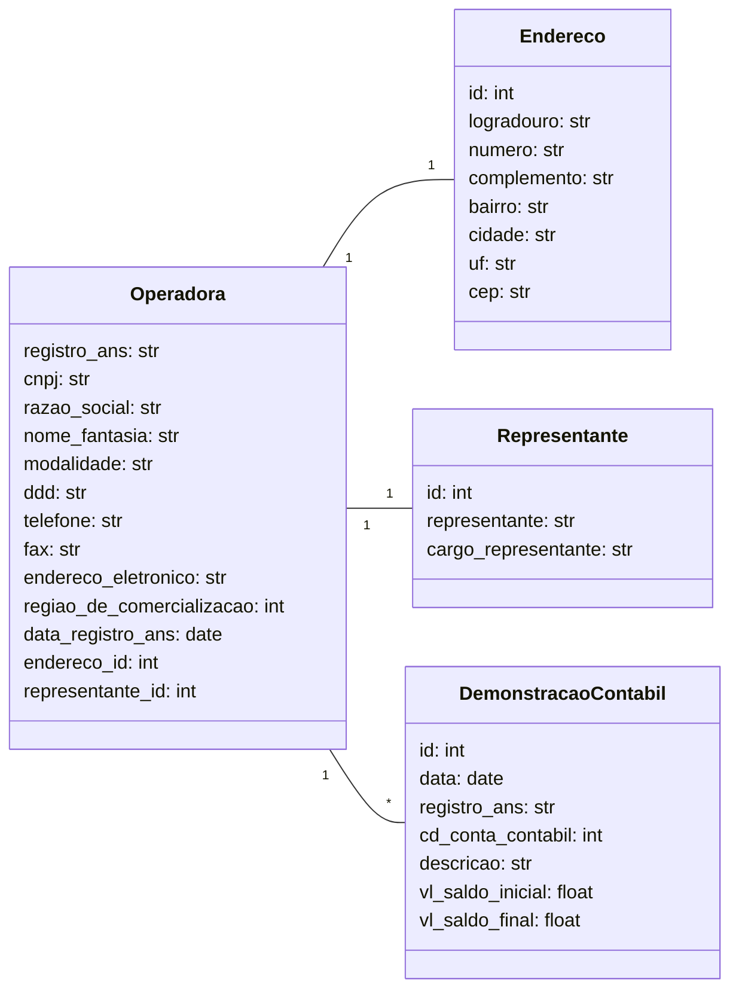

# Teste em Python

O teste está dividido em quatro partes: **Web Scraping, Transformação de Dados, Banco de Dados e API**.

---

## Configuração do Projeto

### Instalação

Siga os passos abaixo para configurar o projeto:

#### 1. Clone o repositório

Clone o repositório do projeto no seu diretório local:

```bash
git clone https://github.com/rubensrabelo/teste_em_python.git
```

Para rodar a aplicação localmente, siga os passos abaixo:

### 2. Criar o Ambiente Virtual

Crie o ambiente virtual para isolar as dependências do projeto. No terminal, execute o seguinte comando:

```bash
python -m venv venv
```


### 2. Ativar o Ambiente Virtual

Ative o ambiente virtual para isolar as dependências do projeto. No terminal, execute o seguinte comando:

```bash
source .venv/bin/activate (Linux)

venv\Scripts\activate.bat (Windows)
```

### 3. Instalar as Dependências
Com o ambiente virtual ativado, instale as dependências listadas no arquivo requirements.txt utilizando o gerenciador de dependências `pip`:

```bash
pip install -r requirements.txt
```

### 4. Executar a Aplicação (Pastas de 01 a 03)
Após a instalação das dependências, você pode iniciar os testes das pastas 01 a 03 da aplicação com o comando:

```bash
python main.py  # Pipeline para rodar os outros arquivos
```

### 5. Executar a Aplicação da API (Pasta 04 - API)
Após a instalação das dependências, você pode iniciar o servidor da aplicação com o comando:

```bash
fast dev main.py ou uvicorn main:app --reload
```

### 6. Acesse a documentação interativa da API no navegador:

- Swagger UI: http://127.0.0.1:8000/docs
- Redoc: http://127.0.0.1:8000/redoc
---

## 01. Web Scraping

**Objetivos**:  
- Download de dois arquivos em formato **PDF**.  
- Compactação de todos os arquivos em um único arquivo (**ZIP, RAR, etc.**).  

### Estrutura de Diretórios  

```plaintext
01_web_scraping/
│── main.py               # Arquivo principal que direciona a execução do teste (Execute esse)
│
├── pdf_manager/
│   ├── pdf_manager.py    # Realiza o download dos arquivos utilizando BeautifulSoup
│
├── zip_manager/
│   ├── zip_manager.py    # Compacta os PDFs baixados
```

## 02. Transformação de Dados

**Objetivos:**
- Extrair os dados da tabela do primeiro PDF do teste 01
- Salvar os dados em uma tabela estruturada no formato CSV.
- Compactar o arquivo CSV.
- Substituir as abreviações das colunas pelas descrições completas.

### Estrutura de Diretórios 

```plaintext
02_data_transformation/
│── main.py               # Arquivo principal que direciona a execução do teste (Execute esse)
│
├── csv_manager/
│   ├── csv_manager.py    # Transforma a tabela do PDF em CSV
│
├── df_manager/
│   ├── df_manager.py     # Converte a tabela para DataFrame para manipulação com Pandas
│
├── zip_manager/
│   ├── zip_manager.py    # Compacta o CSV gerado
```

## 03. Banco de Dados

**Objetivos:**
- Criar queries para estruturar as tabelas necessárias para armazenar o CSV.
- Elaborar queries para importar os dados corretamente, considerando encoding.
- Desenvolver uma query analítica para responder às perguntas solicitadas.

### Diagrama de Classes



### Estrutura de Diretórios
```plaintext
03_database/
│── main.py                      # Arquivo principal que direciona a execução do teste (Execute esse)
│── .env-example                  # Contém os links necessários para realizar o teste (Renomeie para .env)
│
├── modules/
│   ├── scrap_data_base.py        # Realiza o download dos arquivos para o teste
│   ├── process_accounting_statements.py  # Junta todos os CSVs das demonstrações contábeis
│   ├── process_data_operators.py # Separa o CSV das operadoras ativas em três entidades
│
├── scripts_sql/                  # Contém os arquivos SQL para criação, inserção e seleção no PostgreSQL
```

## 04. API
**Objetivo:**
- Desenvolver uma API utilizando FastAPI para realizar uma busca textual no primeiro CSV do teste 03.

### Estrutura de Diretórios

```plaintext
04_api/
│── main.py                        # Arquivo principal que direciona a execução do teste (Execute esse)
│
├── scraping/
│   ├── download_csv.py             # Realiza o download do CSV utilizado nesta etapa
│
├── repository/
│   ├── operator_repository.py      # Faz o download do CSV e transforma em DataFrame do Pandas
│
├── service/
│   ├── operator_service.py         # Contém as regras de negócio para execução das rotas
│
├── api/
│   ├── controller.py               # Controla o fluxo entre a main.py e as rotas
│   ├── router/
│   │   ├── operator_router.py      # Define as rotas da API
```